# Manipulating an HBase table using SHELL commands

This document contains HBase shell commands to perform various tasks on a `users` table with two column families: `info` and `contact`.

---
## Start Docker Containers in Detached Mode

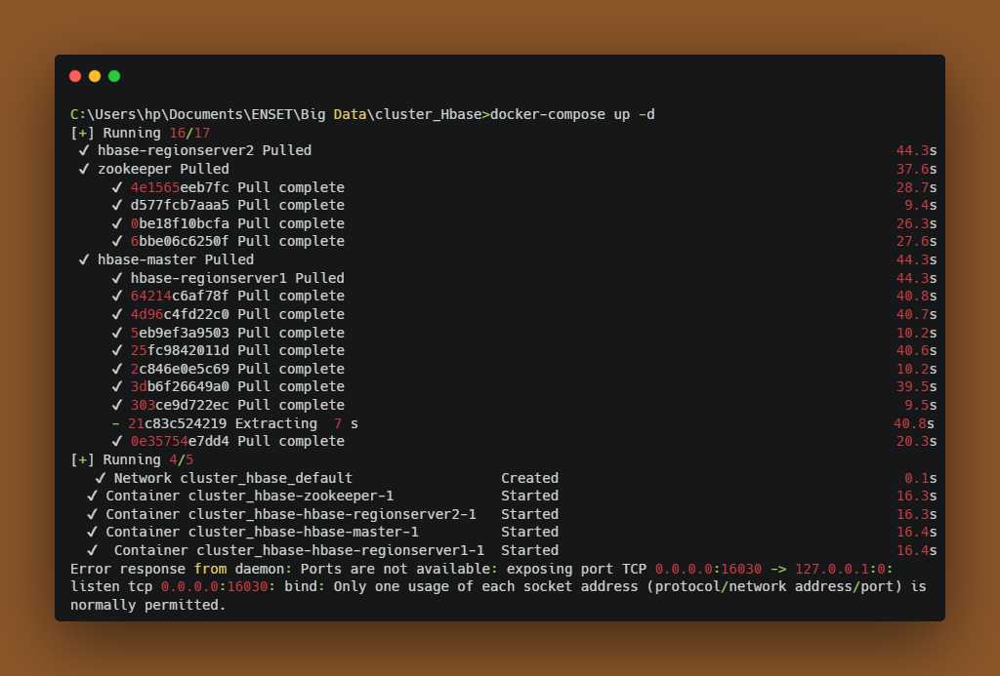

## Starting the HBase Shell:

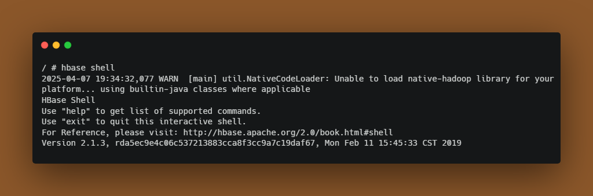

## Task 1: Create the Table

Create a table named `users` with two column families: `info` and `contact`.

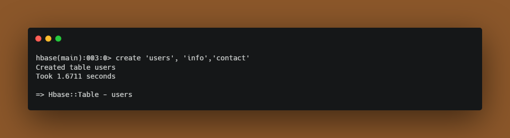

## Task 2: Insert the First User
Insert a row with the key 'user1' and the following columns:
- info:firstName = "ahmed"
- info:lastName = "tazi"
- contact:email = "aahmed.tazi@example.com"
- contact:phone = "0102030405"

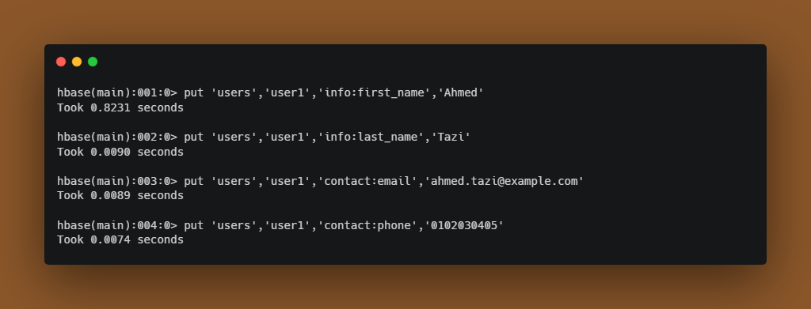

## Task 3: Insert the Second User
Insert a row with the key 'user2' and the following columns:
- info:firstName = "asmae"
- info:lastName = "karimi"
- contact:email = "asmae.karimi@hotmail.com"
- contact:phone = "0607080910"

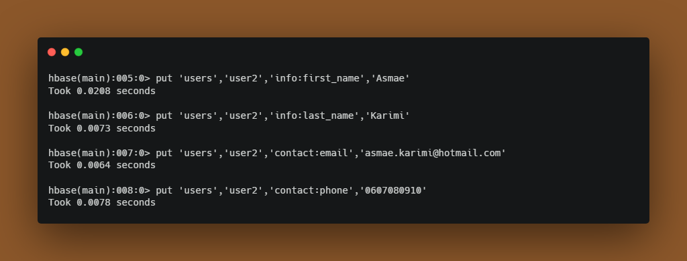

## Task 4: Retrieve a Row
Retrieve all information for the row with the key 'user1'.

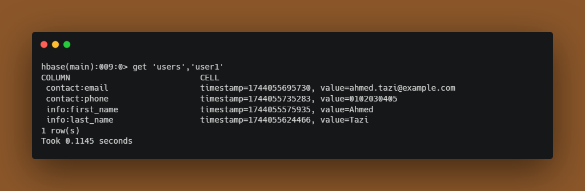

## Task 5: Full Table Scan
Execute a scan on the 'users' table to view all data.

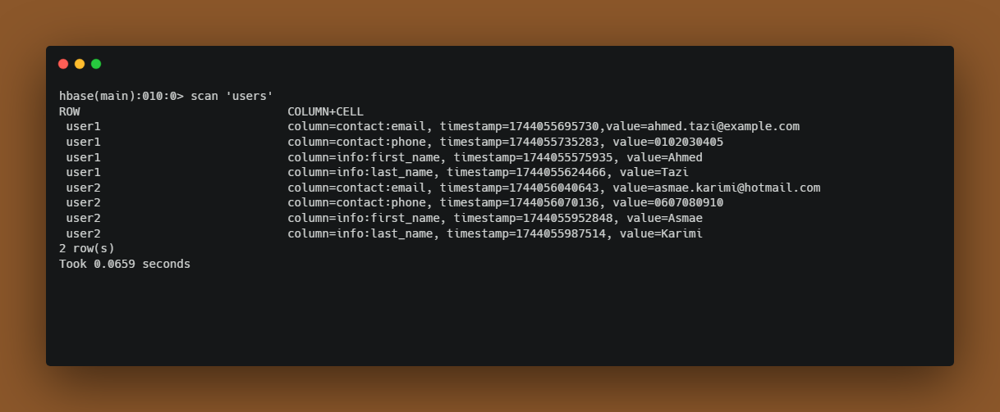

## Task 6: Update Data
Update the email address for 'user2' to 'asmae.karimi@gmail.com'.

## Task 7: Delete a Column
Delete the column 'contact:phone' from the row 'user1'.

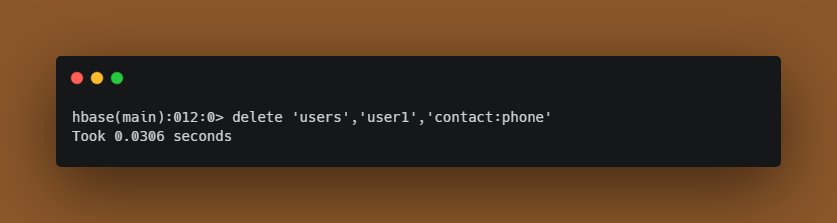

## Task 8: Delete a Row
Delete the entire row 'user2'.

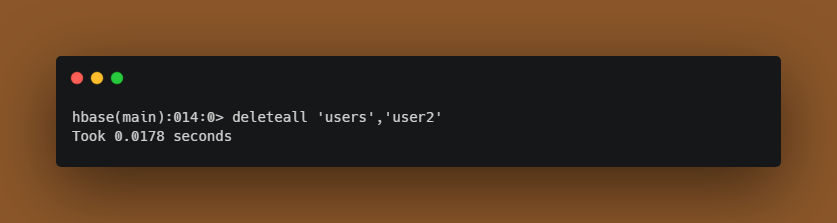

## Task 9: Add a New Column
Modify the 'users' table to add a new column 'contact:fax' to the 'contact' column family.

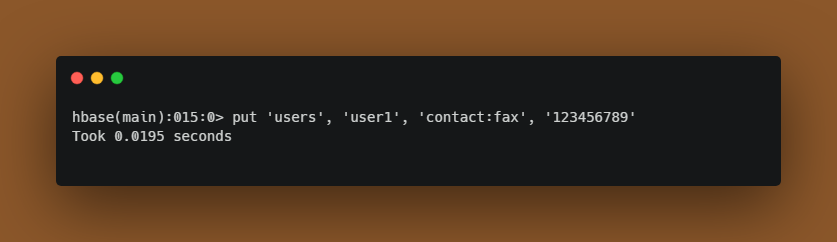

## Task 10: Add New Rows

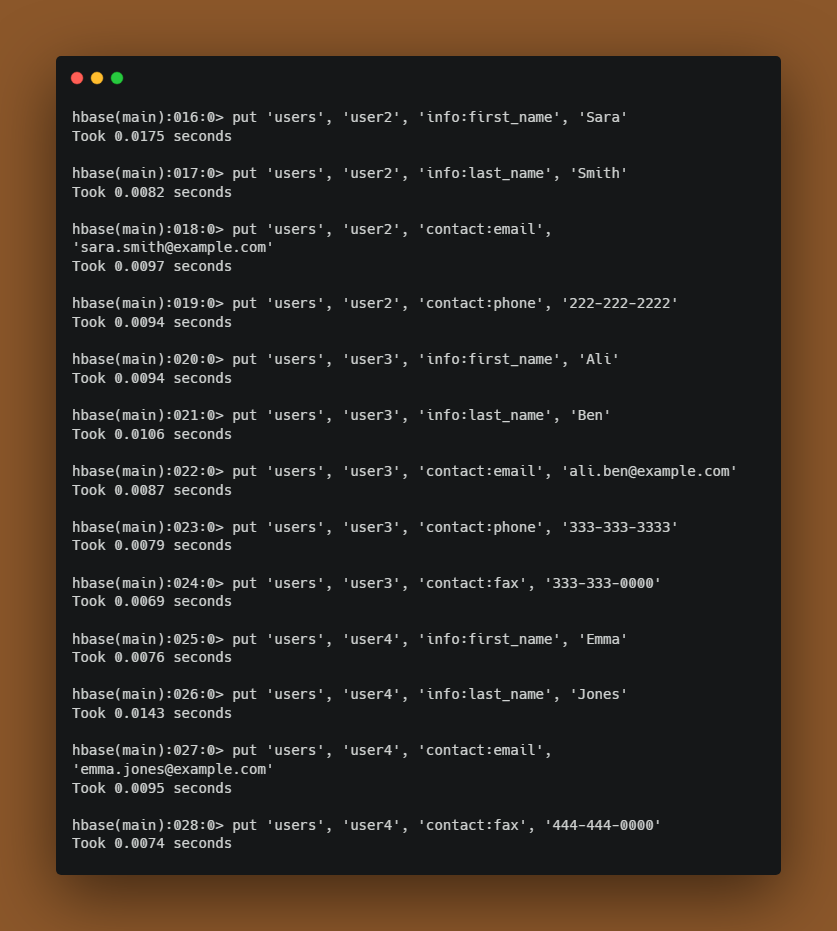

## Task 11: Scan with Key Range
Perform a scan on the 'users' table for rows between 'user1' and 'user3'.

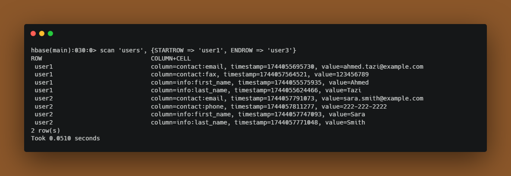

## Task 12: Count the Rows
Use the count command to get the total number of rows in the 'users' table.

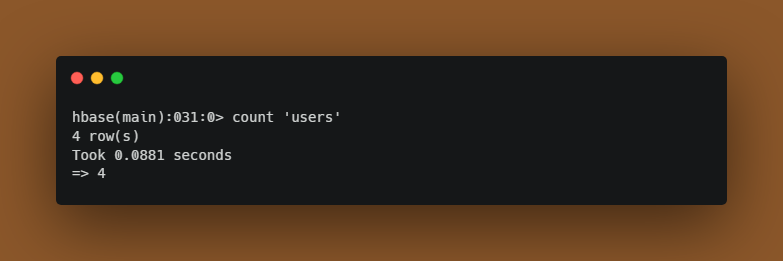

## Task 13: Describe the Table
Display the structure (families and options) of the 'users' table.

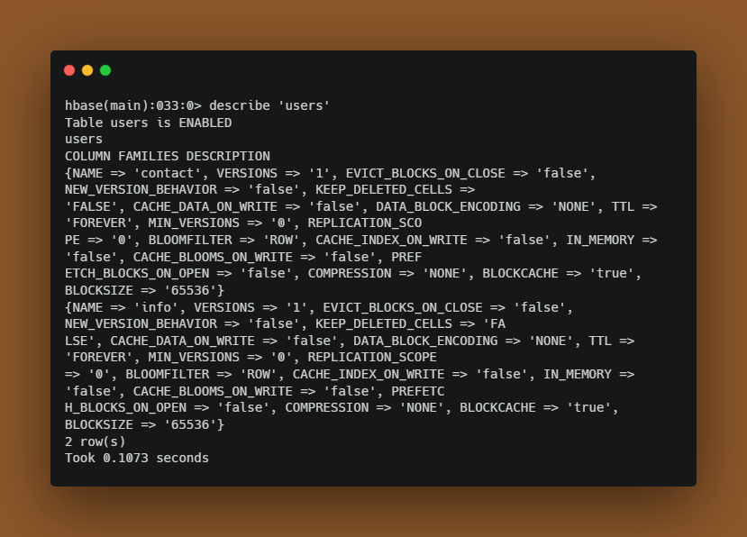
